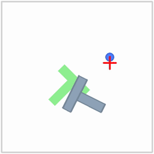
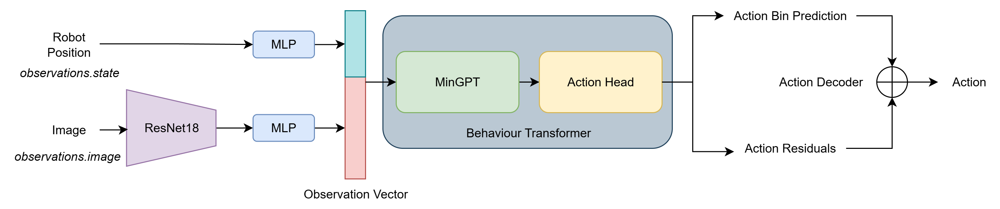
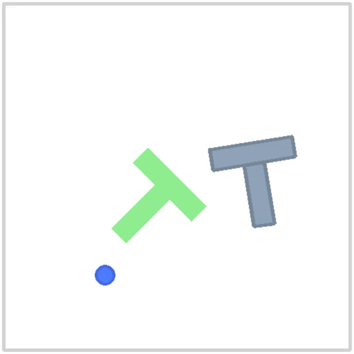

# BeT-PushT
## Contents
- [Introduction](#introduction)
- [Design Choices and Challenges](#design-choices-and-challenges)
- [Results](#results)
- [Future Improvements and Scaling](#future-improvements-and-scaling)

## Introduction

This repository contains an implementation of **Behavioural Transformer (BeT)** for the **PushT dataset**, where a robot learns to push a T-shaped object into a T-shaped target region. The figure illustrates the task using a diffusion policy.

<div align="center">
  
</div>

The **PushT dataset** consists of episodes with two types of observations: image observations of the scene and the positional state of the robot. The task is to predict actions that move the robot to successfully push the T-shaped object into the T-shaped target region.

The approach combines visual and positional information in a sequence-aware manner. Image observations are passed through a **ResNet** to extract visual features, while the robot positional states are processed with a separate **MLP**. The image and state features are then concatenated and provided as input to the **Behavioural Transformer (BeT)**. The transformer outputs the **robot target position** for the next step. This architecture allows the model to leverage both the visual context and robot state information when deciding actions.

## Quickstart

The repository can be cloned and run as follows:

```bash
git clone https://github.com/gautham-98/BeT-PushT.git
cd BeT-PushT
pip install -r requirements.txt 
```

Optionally, WandB can be used for experiment logging:

```bash
wandb login
```

Training is started with:

```bash
python train.py --config "config.yaml"
```

Evaluation is run with:

```bash
python evaluate.py --config "config.yaml"
```
For experiments I have relied on Google Colab for GPUs and the `requirements.txt` have the requirements for a T4 GPU instance in google Colab. The `main.ipynb` notebook can be used to run the scripts in Colab. The parameters for training and evaluation, including the neural network hyperparameters can be configured from `config.yaml`.

## Design Choices and Challenges

<div align="center">
  
</div>

The main design choice was **multi-modal processing**: using ResNet for images, MLP for robot states, and combining them before passing into the Behaviour Transformer. The robot MLP upscales the 2 dimensional state to 16 dimensional tensor, the MLP after Resnet downscale the 512-dimensional feature embedding from ResNet as a 64-dimensional tensor. These are then concatenated to create a 80 dimensional observation tensor which is then passed to the BeT model. The action output is the target robot position. This is implemented in the class `ImageStateObservation` in `BeT-PushT/src/models/observations.py`. The class can also be configured to just use the observation image and avoid using the robot position. 

**Challenges faced**: hyperparameter optimization which requires multiple runs was difficult due to limited GPU availability on Google Colab. Current results are limited to failure videos.

## Results
<div align="center">
  
</div>

At this stage, we only have qualitative results showing failed attempts. No quantitative metrics have been obtained yet, although the evaluation script is complete and available at `BeT-PushT/src/evaluation/evaluation.py`. These failure videos are still useful for debugging and understanding model behavior.

Rollout settings were programmed in `gym_pusht` environment. The following metrics has been setup in the rollouts for evaluating the policy - 

1. Success rate - The number of times policy was able to achieve an overlap of 95% of the T-block with the target region in 100 runs expressed as a percentage.
2. Average maximum overlap - The maximum overlap achieved in every rollout is measured and averaged across all the 100 runs. 

The evaluation settings such as maximum steps per rollout and the number of rollout runs can be configured from `config.yaml`.

## Future Improvements and Scaling

1. Hyperparameter tuning for better results.
2. Ablation study with only image as input compared to image and object position as input.
3. Cross-attention instead of simple concatenation between both input modalities to create input observation vector. The robot position can be used as a query and the image features can be used as keys. 
4. Train the model for real-world settings for tasks such as object sorting etc.


