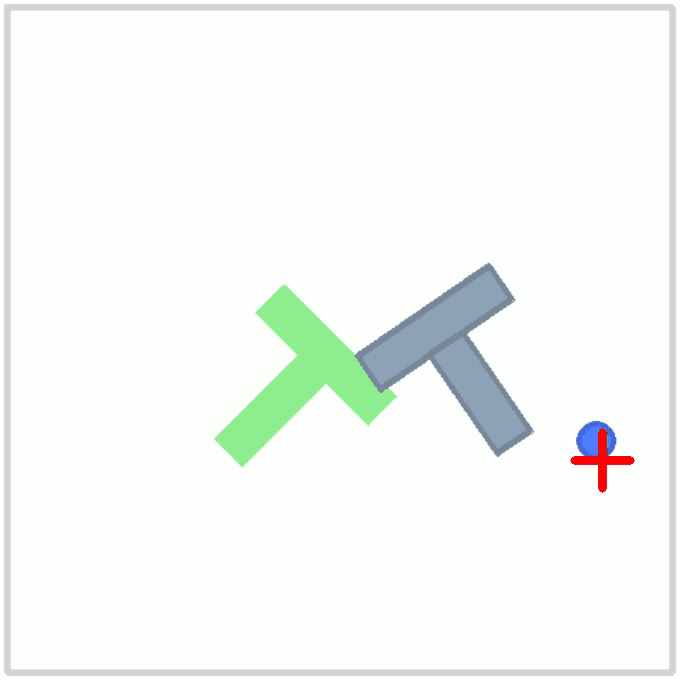
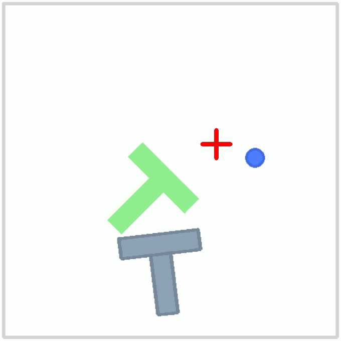
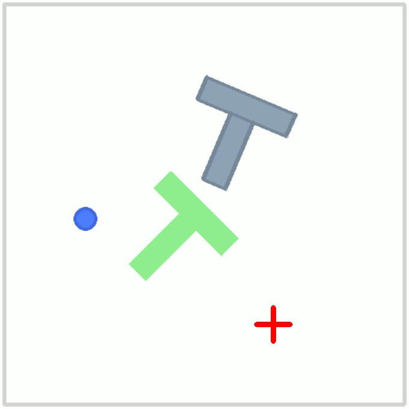
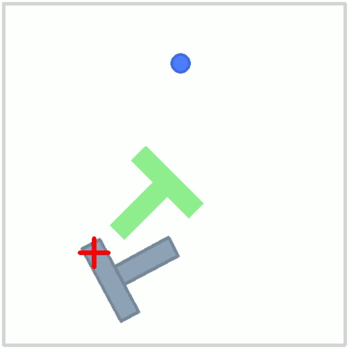
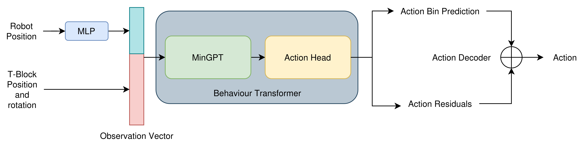
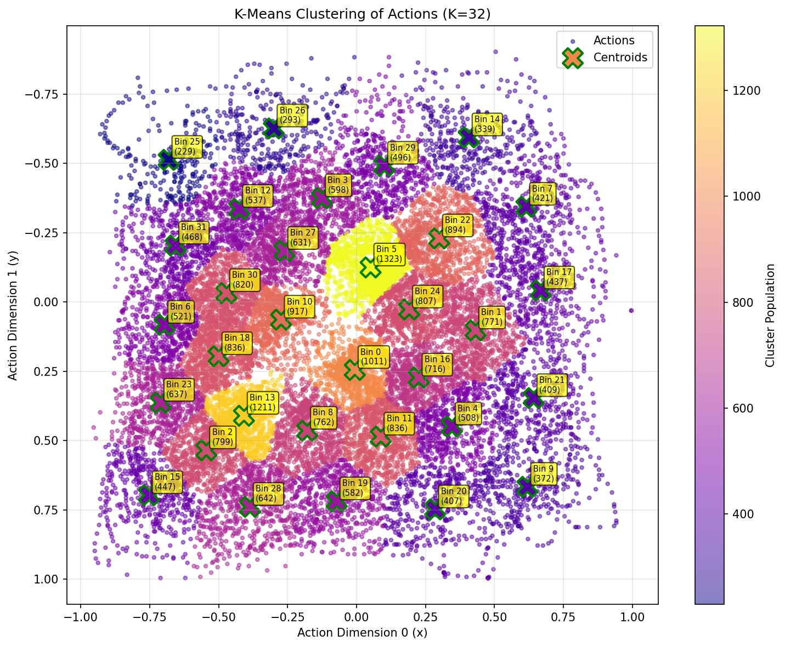

# BeT-PushT

## Contents
- [Introduction](#introduction)
- [Architecture](#architecture)
- [Quickstart](#quickstart)
- [Configuration](#configuration)
- [Design Choices](#design-choices)

## Results

<div align="center">
  
  
  
  
</div>

## Introduction

This repository implements **Behaviour Transformer (BeT)** ([Shafiullah et al., 2022](https://arxiv.org/abs/2206.11251)) for the **PushT** robotic manipulation task, where an agent learns to push a T-shaped block into a target region from human demonstrations.

The agent observes only the **5D state**: agent position (x, y), block position (x, y), and block angle: and predicts a 2D target position for the agent at each step. The model is trained on the `pusht_cchi_v7_replay.zarr` dataset (~206 episodes, ~25k timesteps) using imitation learning.

## Architecture

<div align="center">
  
</div>

BeT treats action prediction as a **sequence modelling problem** over discretised actions:

1. **Action discretisation**: K-means clusters the training actions into `num_bins` centroids. Each action is represented as a bin index + residual offset from the centroid.

<div align="center">
  
</div>

2. **GPT backbone**: A causal transformer takes a window of `sequence_length` normalised states and produces per-timestep embeddings.

3. **Action head**: A linear layer maps each embedding to bin logits and per-bin residual predictions.

4. **Loss**: Focal loss for bin classification + MSE on the residual at the ground-truth bin (via `MultiTaskLoss`).

At inference, a bin is sampled from the predicted distribution (multinomial, not argmax) to preserve multimodality, and the corresponding residual prediction is added to the centroid to recover the continuous action.

## Quickstart

```bash
git clone https://github.com/gautham-98/BeT-PushT.git
cd BeT-PushT
pip install -r requirements.txt
```

Optionally enable WandB logging:

```bash
wandb login
```

**Train:**

```bash
python train.py --config config.yaml
```

**Evaluate:**

```bash
python evaluate.py --config config.yaml
```

The `requirements.txt` targets a Colab T4 GPU environment.

## Configuration

All hyperparameters are set in `config.yaml`:

| Section | Key | Description |
|---|---|---|
| `data` | `zarr_path` | Path to the PushT zarr dataset |
| `data` | `sequence_length` | Observation history window length |
| `data` | `batch_size` | Training batch size |
| `action` | `num_bins` | Number of K-means action clusters |
| `observation` | `embedding_dim` | Transformer internal embedding size |
| `bet_model` | `num_transformer_layers` | Number of GPT transformer layers |
| `bet_model` | `num_attention_heads` | Number of attention heads |
| `training` | `gamma` | Focal loss gamma (0 = plain cross-entropy) |
| `training` | `residual_loss_scale` | Weight on the residual MSE loss |
| `evaluation` | `num_rollout` | Number of evaluation episodes |
| `evaluation` | `max_episode_steps` | Max steps per rollout |

## Design Choices

**State-only observations.** The 5D state (agent xy, block xy, block angle) is directly projected into the transformer embedding space via a learned linear layer. 

**Action normalisation.** Positions are mapped from `[0, 512]` to `[-1, 1]`. The block angle from the environment is in `[0, 2π]` (pymunk accumulates angles; `get_obs()` wraps them with `% 2π`), normalised to `[-1, 1]` by dividing by π and subtracting 1. Evaluation observations use the same wrapping to stay in-distribution.

**Dataset construction.** Only timesteps with a complete `sequence_length` history are used: no padding at episode boundaries. This ensures every training sequence contains fully valid observations.

**Residual loss.** The MSE for residual prediction is computed at the **ground-truth bin** position (not the stochastically sampled bin), following the original paper. This is implemented via `MultiTaskLoss` in `src/training/losses.py`.

**Evaluation metric.** The primary metric is **mean max coverage**: the peak T-block coverage achieved at any point during each rollout, averaged across episodes: rather than final-step coverage.
